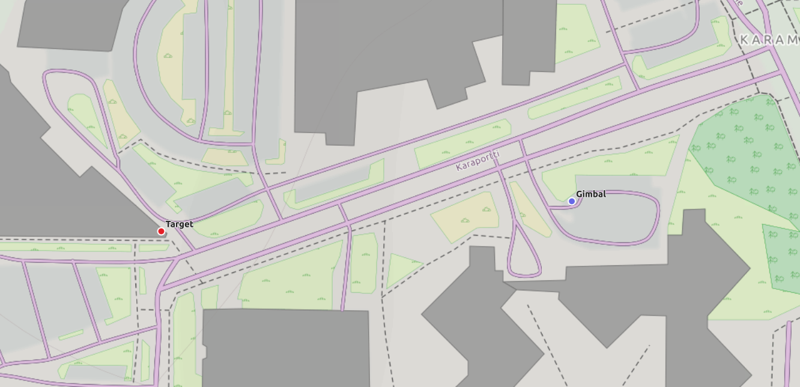

Levitezer Protocol
==================

> Please note: Levitezer Protocol is under development, definitions are subjected to be changed

# Table of contents
- [Levitezer Protocol](#levitezer-protocol)
  * [Message Structure](#message-overview)
    + [Header](#header)
    + [Data](#data)
    + [End of Message](#end-of-message)
    + [Checksum](#checksum)
  * [Parameter Descriptions](#parameter-descriptions)
    + [Data Provided by Gimbal](#data-provided-by-gimbal)
    + [Gimbal Control Parameters](#gimbal-control-parameters)
    + [Black Magic Camera Parameters](#black-magic-camera-parameters)
    + [Controller Parameters](#controller-parameters)  
  * [Examples](#examples)
    + [Trigger Camera Recording](#Trigger-Camera-Recording)
    + [Gimbal Joystick Control](#Gimbal-Joystick-Control)    
    + [Gimbal Angle Control](#Gimbal-Angle-Control)

# Message Structure
Any message between two systems is compound of 

    |___Header___||___Data___||__End_of_message__||__Checksum__|

There is 2 Modes for the Messages:
 * Standard Mode
 * Binary Mode
 
 
    
The byte order is always "little endian". Meaning the least significant byte is always first in any parameter. For example a 16 bit integer must be transmitted like this
 ```c
     int16 n = 0xF137;
     byte data[]{
         n & 0xFF,  /* this is 0x37 */
         n >> 8     /* this is 0xF1 */
     }
```
Then on the other end it can be reassembled:
```c
int16 n = (data[0] | data[1] << 8);
```


 #### Message Example
|   starting bytes   | device id | device type |    counter   | mode |               Data                    |   Checksum     |
|:------------------:|:---------:|:-----------:|:------------:|:----:|:-------------------------------------:|:---------------:|
|0xFF 0xFF 0xFF      |    0x07   |    0x02     |  0x71        | 0x00 | 0x02 0xAA 0x92 0x33 0x41 0x00         |   0x00 0x2C 0x02  |

This message is in standard mode, is meant for Camera id 7 and contains 2 parameters in the data payload

## Header
Header is the firs 6 bytes of the message and it tells "who" sent this message (or "who" should receive it) and how to read it.

|       Field        | bit size | valid byte range |              Observations                |
|:------------------:|:---------:|:----------------:|:----------------------------------------:|
|`<Starting_Bytes>`  | 8+8+8     | 255-255          | Just a sequence of 3 decimal "255" or hexadecimal "FF"|
|`<Device_ID>`       | 8         | 0-254            |       |
|`<Device_Type>`     | 8         | 0-254            |       |
|`<Counter>`         | 7         | 0-127            |                                                      |
|`<Mode>`            | 1         | 0-1              | 0: Standard Message, 1: Binary Message             |


 * Starting_Bytes: this is a sequence of 3 bytes which values are always `255` or `FF` in hexadecimal. This identifies the starting of the message.
 * Device_ID: Identifies the device which will receive the message (or from which the message came). This id can be given by the user 

 * Device_Type: it can be one of the following:
 
|            Type Name                                                 | Type|
|:--------------------------------------------------------------------:|:---:| 
| Gimbal - BaseCam Serial API v2                                       |  1  |
| Camera - Blackmagic SDI and Bluetooth Camera Control Protocol v1.3   |  2  |
| Controller  (i.g. Joysticks)                                         |  3  |
| Levitezer Lens Control                                               |  4  |
| Box (like eeprom varialbes)                                          | 254 |
 
Every device has its own set of parameters which is up to 254 parameters.

 * Counter+Mode: Packed on the same byte is the counter and the mode
     - counter:  a counter that overflows every 127 messages. This may be useful to keep track of the message order 
     - mode: message uses standard or binary data.


## Data
### Standard Mode
Data is between the header and the end of the message. Here are the parameters of the device. Each parameter value is always 16 bits (little endian order) preceded by an 8 bit id. Therefore every data field is 3 bytes. All the parameters must be for the same device and it cannot be more than 254 parameters.


|       Field        | byte size | valid byte range |              Observations                         |
|:------------------:|:---------:|:----------------:|:-------------------------------------------------:|
|`<ID>`              | 1         | 1-254            |                                                   |
|`<VALUE>`           | 2         | 0-255            | data order is little endian `<Low_byte High_byte>`|

```
... <ID_0> <VALUE_0>, <ID_1> <VALUE_1> ... <ID_x> <VALUE_X> ...
```

Example: send the farthest focus. The id is '2'. and the max value is '2047' ('0800' in hexadecimal).
Then the data field are the three bytes following bytes (note the low byte is first):

|   id    |    low   |  high   |
|:-------:|:--------:|:-------:|
|   02    |   00     |   08    |

### Binary Mode
This mode is meant to transmit data that is not convenient on the standard 16 bit parameter mode. Such as big, grouped parameters and the ones that required conversion.
The binary Mode uses the following structure after the header (every number is a byte):
```
01 MM MM 02 DD DD 03 DD DD 04 DD DD 05 DD DD .... 00 CS CS
```

each 'DD' is a byte of data. The data bytes are between a sequence of numbers as shown above. The first two bytes of data `MM MM` after `01` are a 16 bit integer Id that identifies the data.

Note that data starts after `02` sequence number. The sequence numbers can get up to `254`. Which makes the maximum data size `2*254 = 508 bytes` 

### Checksum
The last part of the message is the checksum, which is a 16 bit `CS CS` number after `00` sequence number. The checksum is calculated as a sum of all bytes on the message but the `<Starting_Bytes>` using modulo 65536 operation (0x10000).


# Parameter Descriptions


## Data Provided by Gimbal


| Id  |                 name                   |  min   | max    |                                  Observations                          |
|:---:|----------------------------------------|:------:|:------:|------------------------------------------------------------------------|
| 1   | IMU_ROLL                               | -32768 |   32767| Current IMU angles (relative to motors themselves). Unit: 0.02197265625 degrees, which gives ±720 degree range |
| 2   | IMU_PITCH                              | -32768 |   32767| //                                                                     |
| 3   | IMU_YAW                                | -32768 |   32767| //                                                                     |
| 4   | ROLL                                   | -32768 |   32767| Current relative angles (relative to the the gimbal frame) Unit: 0.02197265625 degrees, which gives ±720 degree range |
| 5   | PITCH                                  | -32768 |   32767| //                                                                     |
| 6   | YAW                                    | -32768 |   32767| //                                                                     |
| 7   | TIMESTAMP                              |        |        | Timestamp of the received angles                                       |
| 13  | ACCEL_ROLL                             | 0      | 1275   | Current acceleration value                                             |
| 14  | ACCEL_PITCH                            | 0      | 1275   | //                                                                     |
| 15  | ACCEL_YAW                              | 0      | 1275   | //                                                                     |
| 18  | ANGLE_COMPLETED                        |        |        |  Notification to confirm that a new angle was set                      |
| 19  | REQUEST_REAL_TIME_DATA                 | 0      | 65536  |  Last Real Time interval that was set                                  |
| 21  | BOARD_VERSION                          |        |        |  Board version multiplied by 10                                        |
| 22  | FIRMWARE_VERSION                       |        |        |  Split into decimal  digits X.XX.X, e.g. 2305 means 2.30b5            |


## Gimbal Control Parameters


| Id  |                 name                   |  min   | max    |                                  Observations                          |
|:---:|----------------------------------------|:------:|:------:|------------------------------------------------------------------------|
| 4   | ROLL                                   | -32768 | 32767  | Set this axis angle .Unit: 0.02197265625 degrees, which gives ±720 degree range  |
| 5   | PITCH                                  | -32768 | 32767  | //                                                                     |
| 6   | YAW                                    | -32768 | 32767  | //                                                                     |
| 10  | SPEED_ROLL                             | -32768 | 32767  | Set this axis speed. Unit: 0.1220740379  degrees/sec. Note, when using angle mode (Control Mode=2), the minimum speed is 0 |
| 11  | SPEED_PITCH                            | -32768 | 32767  | //                                                                     |
| 12  | SPEED_YAW                              | -32768 | 32767  | //                                                                     |
| 13  | ACCEL_ROLL                             | 0      | 1275   | Set this axis acceleration limit. Unit: 1 degree/sec^2. Note: optimal rate of sending is 1 Hz. So it should not sent which the same frequency than others. Note 2: 0 Acceleration will disable this axis movement altogether.  |
| 14  | ACCEL_PITCH                            | 0      | 1275   | //                                                                     |
| 15  | ACCEL_YAW                              | 0      | 1275   | //                                                                     |
| 16  | CONTROL_MODE                           |        |        | values can be: 0 - Mode no control: gimbal ignores angle and speed data</br> 1 - Mode speed: gimbal moves to speed sent. Note: Optimal rate of sending speed is 50-100Hz</br> 2 - mode angle: gimbal goes to specified angle using specified speed (will slow down near target speed) |
| 17  | LEVEL_ROLL                             |        |        |  Sets IMU_ROLL angle to 0                                              |
| 18  | ANGLE_COMPLETED                        |        |        |  Notification to confirm that a new angle was set                      |
| 19  | REQUEST_REAL_TIME_DATA                 | 0      | 65536  |  Sets the frequency which Real time data is received in milliseconds   |
| 21  | BOARD_VERSION                          |        |        |  Request board information. Will return board and firmware version     |
| 23  | ROLL_OFFSET                            | -32768 |  32767 | Offsets the specified amount to the the axis                           |
| 24  | PITCH_OFFSET                           | -32768 |  32767 | //                                                                       |
| 25  | YAW_OFFSET                             | -32768 |  32767 | //                                                                       |
<!---| 60  | GIMBAL_LAT0                            | 0      | 65536  | See [Gimbal Geo Point control](#Gimbal-Geo-Point-control)              |
| 61  | GIMBAL_LAT1                            | 0      | 65536  | //                                                                     |
| 62  | GIMBAL_LON0                            | 0      | 65536  | //                                                                     |
| 63  | GIMBAL_LON1                            | 0      | 65536  | //                                                                     |
| 64  | GIMBAL_ALT0                            | 0      | 65536  | //                                                                     |
| 65  | GIMBAL_ALT1                            | 0      | 65536  | //                                                                     |
| 66  | TARGET_LAT0                            | 0      | 65536  | //                                                                     |
| 67  | TARGET_LAT1                            | 0      | 65536  | //                                                                     |
| 68  | TARGET_LON0                            | 0      | 65536  | //                                                                     |
| 69  | TARGET_LON1                            | 0      | 65536  | //                                                                     |
| 70  | TARGET_ALT0                            | 0      | 65536  | //                                                                     |
| 71  | TARGET_ALT1                            | 0      | 65536  | //                                                                     |
-->
Notes:
When controling the gimbal on speed mode you should send CONTROL_MODE=1 + speed axis. Also use a high rate send in the range of 50-100 Hz.

When controling the gimbal on angle mode you should send CONTROL_MODE=2 + speed axis + angle axis. On this case the speed will use to reach the target angle.

#### GPS Data Structure [Still on development]

GPS data is sent on Binary mode. There is 2 Ids; one for the Gimbal coordinates and the other for target coordinates.

| Binary Id  |  byte size  |             name          |                  Observations                          |
|:----------:|:-----------:|:-------------------------:|:------------------------------------------------------ |
|   502      |    40       | Gimbal GPS Coordinates    |  See Table                                             |
|   503      |    40       | Target GPS Coordinates    |  See Table                                             |

Both GPS binary message are the same structure. The parameters are based on C language types and they are packet on the same order as in the following table

| name                     |                  Observations                          |
|:------------------------:|:-------------------------------------------------------|
|  Latitude                |  64 bit IEEE-754 Double float                          |
|  Longitude               |  64 bit IEEE-754 Double float                          |
|  Altitude                |  64 bit IEEE-754 Double float                          |
|  Heading                 |  32 bit IEEE-754 Single float                          |
|  Speed                   |  32 bit IEEE-754 Single float                          |
|  Timestamp               |  32 bit Unsigned interger                              |
|  day                     |  8 bit Unsigned interger                               |
|  month                   |  8 bit Unsigned interger                               |
|  year                    |  8 bit Unsigned interger                               |
|  status                  |  8 bit Unsigned interger                               |


Since datatypes are C language based. You can take advantage of C Unions to pack and receive the data without doing any extra conversions. you just need to copy the binary data to the `dataArray` field inside the Union, after that all parameters are available. And the other way around also works; you set every parameter and `dataArray` is ready to be sent with all the data.
```c
union GpsDataUnion{
    struct  GpsData{
        double lat;
        double lon;
        double alt;
        float heading;
        float speed;
        uint32_t timestamp;
        uint8_t day;
        uint8_t month;
        uint8_t year;
        uint8_t status;
    } data;
    uint8_t dataArray[sizeof(GpsData)];
};
```
Also on python we also can use c unions through ctypes.
```python
from ctypes import (
        Union, Array, Structure,
        c_uint8, c_uint32, c_float, c_double
)

ARRAY_SIZE = 40

class uint8_array(Array):
        _type_ = c_uint8
        _length_ = ARRAY_SIZE

class gps_data(Structure):
        _fields_ = (
		("lat", c_double),
		("lon", c_double),
		("alt", c_double),
		("heading", c_float),
		("speed", c_float),
		("timestamp", c_uint32),
		("day", c_uint8),
		("month", c_uint8),
		("year", c_uint8),
		("status", c_uint8)
		)
  
class gps_data_union(Union):
    _fields_ = (
    ("data", gps_data),
    ("byteArray", uint8_array)
    )
```
<!---
#### Gimbal Geo Point control
One way of controling the gimbal is by pointing to a target geo coordinate (lat, lon, alt) relative to the own gimbal geo coordinate. It will move the gimbal yaw and pitch.



Latitudes and Longitudes are in decimal format multiplied by 10^7.
Altitudes are in decimal format multiplied by 100.
```python
lat = 60.2241444 * 1e7 # = 602241444
lon = 24.7578934 * 1e7 # = 247578934
alt = 112.55 * 100     # = 11255
```

Since every parameter in LeViteZer protocol is 16 bits, there are two ids per coordinate component. To do this we split every component to 2 16 bit variables:
```python
lat_0 = lat & 0xFFFF
lat_1 = lat >> 16
lon_0 = alt & 0xFFFF
lon_1 = alt >> 16
alt_0 = alt & 0xFFFF
alt_1 = alt >> 16
```
Latitude range is From -90 (south pole) to 90 degrees (north pole);
Longitude range is From -180 to 180 degrees

-->

## Black Magic Camera Parameters

The following parameters controls cameras using the Blackmagic SDI and Bluetooth Camera Control Protocol. Camera parameters must be send at rates below 24 Hz. If they are sent at higher frequency for short period, they will be enqueued and eventually sent to camera, but if the queue gets full then new data will be dropped.

#### Camera Ids
Usually a BMD camera can be given an Id in the 1-99 range. This is the id that must be used on the Header "device id" field. A special case is a Bluetooth camera. Messages sent to bluetooth cameras use id 100.

#### Grouped parameters
Some parameters should be sent grouped in the same message always, these are indicatd by the hint `(grouped)`

### Lens
| Id  |                 name                   |  min   | max    |                                  Observations                          | BMD Id |
|:---:|----------------------------------------|:------:|:------:|------------------------------------------------------------------------|:------:|
| 2   | Focus                                  | 0      | 2047   | 0=near, 2047=far                                                       | 0.0    |
| 3   | Autofocus                              |        |        |                                                                        | 0.1    |
| 4   | Aperture (F-Stop    )                  | -2047  | 32767  | Aperture value where fnumber = sqrt(2^AV)                              | 0.2    |
| 5   | Aperture (Normalised)                  | 0      | 2047   | 0=smallest, 2047=largest                                               | 0.3    |
| 6   | Aperture (Ordinal   )                  | 0      | n      | Steps through available aperture values from minimum (0) to maximum (n)| 0.4    |
| 7   | Autoaperture                           |        |        |       void command                                                     | 0.5    |
| 8   | Optical image Stabilization            | 0      | 1      | 0=disabled, 1 or greater=enabled                                       | 0.6    |
| 9   | Absolute Zoom (mm)                     | 0      | 2047   | Move to specified focal in mm, from 0mm to maximum of the lens         | 0.7    |
| 10  | Absolute Zoom (Normalized)             | 0      | 2047   | Move to specified normalised focal lenght: 0=wide, 2047=tele           | 0.8    |
| 11  | Continous Zoom (Speed)                 | -2048  | 2047   | Start/stop zooming at specified rate: -2047=zoom wider fast, 0.0=stop, +2047=zoom tele fast| 0.9 |
| 12  | Relative Focus                         | 0      | 2047   | Same as foucs but values are added/substracted (Operation=1 in BMD protocol) | 0.0    |


### Color Correction
| Id  |                 name                   |  min   | max    |                                  Observations                          | BMD Id |
|:---:|----------------------------------------|:------:|:------:|------------------------------------------------------------------------|:------:|
| 38  | Luma Mix                               | 0      | 2047   |   Default value: 0                                                     | 8.5    |
| 41  | Correction Reset Default               | 0      | 0      |   void command                                                         | 8.7    |

The following parameters must be send on groups
#### Lift Color Adjustment (grouped)
| Id  |                 name                   |  min   | max    |                                  Observations                          | BMD Id |
|:---:|----------------------------------------|:------:|:------:|------------------------------------------------------------------------|:------:|
| 20  | Lift Adjust Red                        | -4096  | 4095   |   Default value: 0                                                     | 8.0    |
| 21  | Lift Adjust Green                      | -4096  | 4095   |   Default value: 0                                                     | 8.0    |
| 22  | Lift Adjust Blue                       | -4096  | 4095   |   Default value: 0                                                     | 8.0    |
| 23  | Lift Adjust Luma                       | -4096  | 4095   |   Default value: 0                                                     | 8.0    |
#### Gamma Color Adjustment (grouped)
| Id  |                 name                   |  min   | max    |                                  Observations                          | BMD Id |
|:---:|----------------------------------------|:------:|:------:|------------------------------------------------------------------------|:------:|
| 24  | Gamma Adjust Red                       | -4096  | 4095   |   Default value: 0                                                     | 8.1    |
| 25  | Gamma Adjust Green                     | -8192  | 8101   |   Default value: 0                                                     | 8.1    |
| 26  | Gamma Adjust Blue                      | -8192  | 8101   |   Default value: 0                                                     | 8.1    |
| 27  | Gamma Adjust Luma                      | -8192  | 8101   |   Default value: 0                                                     | 8.1    |

#### Gain Color Adjustment (grouped)
| Id  |                 name                   |  min   | max    |                                  Observations                          | BMD Id |
|:---:|----------------------------------------|:------:|:------:|------------------------------------------------------------------------|:------:|
| 28  | Gain Adjust Red                        |  0     | 32767  |   Default value: 2047                                                  | 8.2    | 
| 29  | Gain Adjust Green                      |  0     | 32767  |   Default value: 2047                                                  | 8.2    |
| 30  | Gain Adjust Blue                       |  0     | 32767  |   Default value: 2047                                                  | 8.2    |
| 31  | Gain Adjust Luma                       |  0     | 32767  |   Default value: 2047                                                  | 8.2    |
#### Offset Color Adjustment (grouped)
| Id  |                 name                   |  min   | max    |                                  Observations                          | BMD Id |
|:---:|----------------------------------------|:------:|:------:|------------------------------------------------------------------------|:------:|
| 32  | Offset Adjust Red                      | -10240 | 10240  |   Default value: 0                                                     | 8.3    |
| 33  | Offset Adjust Green                    | -10240 | 10240  |   Default value: 0                                                     | 8.3    |
| 34  | Offset Adjust Blue                     | -10240 | 10240  |   Default value: 0                                                     | 8.3    |
| 35  | Offset Adjust Luma                     | -10240 | 10240  |   Default value: 0                                                     | 8.3    |
#### Contrast (grouped)
| Id  |                 name                   |  min   | max    |                                  Observations                          | BMD Id |
|:---:|----------------------------------------|:------:|:------:|------------------------------------------------------------------------|:------:|
| 36  | Contrast Adjust pivot                  | 0      | 2047   |   Default value: 0                                                     | 8.4    |
| 37  | Contrast Adjust adj                    | 0      | 4095   |   Default value: 2047                                                  | 8.4    |
#### Color Adjust (grouped)
| Id  |                 name                   |  min   | max    |                                  Observations                          | BMD Id |
|:---:|----------------------------------------|:------:|:------:|------------------------------------------------------------------------|:------:|
| 39  | Colour Adjust Hue                      | -2047  | 2047   |   Default value: 0                                                     | 8.6    |
| 40  | Colour Adjust Sat                      | 0      | 4095   |   Default value: 2047                                                  | 8.6    |


### Video
| Id  |                 name                   |  min   | max    |                                  Observations                          | BMD Id |
|:---:|----------------------------------------|:------:|:------:|------------------------------------------------------------------------|:------:|
| 50  | Video Mode (Old method, deprecated)    | -      | -      |   See video mode explanation below                                     | 1.0    |
| 51  | Sensor Gain 1                          | 1      | 16     |   values: 1(-12dB), 2(-6dB), 4(0dB), 8(6dB), 16(12dB)                  | 1.1    |
| 54  | Exposure (ordinal)                     | 0      | n      |   Steps through available exposure values from 0 to the maximum of the camera | 1.6 |
| 55  | Dynamic Range Mode                     | 0      | 1      |   0=film, 1=video                                                      | 1.7    |
| 56  | Video Sharpening Level                 | 0      | 3      |   0=Off, 1=Low, 2=Medium, 3=High                                       | 1.8    |
| 57  | Auto White Balance                     | -      | -      |   Calculate and set White Balance                                      | 1.3    |
| 58  | Auto White Balance Restore             | -      | -      |   Use latest auto white balance setting                                | 1.4    |
| 64  | Auto Exposure                          | 0      | 3      |   0=Manual Trigger, 1=Iris, 2=Shutter, 3=Iris + Shutter, 4=Shutter + Iris | 1.10   |
| 67  | Sensor Gain 2                          | -128   | 127    |  Gain in decibel (dB)                                                 | 1.13   |
| 135 | ND Filter                              | 0      | 32768  |   f-stop of ND filter to use                                          | 1.16   |


#### Exposure (us) (grouped)
Exposure time in microseconds. 32 bit parameter divided in 2 ids
Min value 1.
Max value 42000.
| Id  |                 name                   |  min   | max    |                                  Observations                          | BMD Id |
|:---:|----------------------------------------|:------:|:------:|------------------------------------------------------------------------|:------:|
| 53  | Exposure (us) 1                        | -      | -      |   First 16 bits                                                        | 1.5    |
| 136 | Exposure (us) 2                        | -      | -      |   Remaining 16 bits. Always 0                                          | 1.5    |

#### Shutter Angle (grouped)
Shutter angle in degrees, multiplied by 100. 32 bit parameter divided in 2 Ids.
Min value 100.
Max value 36000.
| Id  |                 name                   |  min   | max    |                                  Observations                          | BMD Id |
|:---:|----------------------------------------|:------:|:------:|------------------------------------------------------------------------|:------:|
| 65  | Shutter Angle 1                        | -      | -      |  First 16 bits                                                         | 1.11   |
| 137 | Shutter Angle 2                        | -      | -      |  Remaining 16 bits. Always 0                                           | 1.11   |

#### Shutter Speed (grouped)
Value as a fraction of 1, i.g 50 for 1/50th of a second . 32 bit parameter divided in 2 ids.
Min value 24.
Max value 2000.
| Id  |                 name                   |  min   | max    |                                  Observations                          | BMD Id |
|:---:|----------------------------------------|:------:|:------:|------------------------------------------------------------------------|:------:|
| 66  | Shutter Speed 1                        | -      | -      |  First 16 bits                                                         | 1.12   |
| 138 | Shutter Speed 2                        | -      | -      |  Remaining 16 bits. Always 0                                           | 1.12   |

#### ISO (grouped)
ISO value. 32 bit parameter divided in 2 ids.
Min value 0.
Max value 2147483647.
| Id  |                 name                   |  min   | max    |                                  Observations                          | BMD Id |
|:---:|----------------------------------------|:------:|:------:|------------------------------------------------------------------------|:------:|
| 68  | ISO 1                                  | -      | -      |   First 16 bits                                                        | 1.14   |
| 139 | ISO 2                                  | -      | -      |   Remaining 16 bits                                                    | 1.14   |


#### Manual White Balance (grouped)
| Id  |                 name                   |  min   | max    |                                  Observations                          | BMD Id |
|:---:|----------------------------------------|:------:|:------:|------------------------------------------------------------------------|:------:|
| 49  | Manual White Balance Tint              | -50    | 50     |                                                                        | 1.2    |
| 52  | Manual White Balance                   | 2500   | 8000   |   Corresponds to color temperature in kelvins                          | 1.2    |
#### Recording Format     (grouped)
| Id  |                 name                   |  min   | max    |                                  Observations                          | BMD Id |
|:---:|----------------------------------------|:------:|:------:|------------------------------------------------------------------------|:------:|
| 59  | Recording Format File FPS              | -      | -      |   fps as integer (eg 24, 25, 30, 50, 60, 120)                          | 1.9    |
| 60  | Recording Format Sensor FPS            | -      | -      |   fps as integer, valid when sensor-off-speed set (eg 24, 25, 30, 33, 48, 50, 60, 120) | 1.9    |
| 61  | Recording Format Width                 | -      | -      |   in pixels                                                            | 1.9    |
| 62  | Recording Format Height                | -      | -      |   in pixels                                                            | 1.9    |
| 63  | Recording Format Flags                 | -      | -      |   bit flags: [0] = file-M-rate, [1] = sensor-M-rate, [2] = sensor-off-speed, [3] = interlaced, [4] = windowed mode  | 1.9    |

#### Display LUT (grouped)
Exposure time in microseconds. 32 bit parameter divided in 2 ids
| Id  |                 name                   |  min   | max    |                                  Observations                          | BMD Id |
|:---:|----------------------------------------|:------:|:------:|------------------------------------------------------------------------|:------:|
| 128 | Display LUT selected                   | 0      | 3      |   0 = None, 1 = Custom, 2 = film to video, 3 = fiml to extend video    | 1.15   |
| 129 | Display LUT enabled                    | 0      | 1      |   0 = Not enabled, 1 = Enabled                                         | 1.15   |

#### Video mode (Grouped)
This is the recomended way to set the Video Mode using (130-134 Ids) as opposed to Id 50. 
| Id  |                 name                   |  min   | max    |                                  Observations                          | BMD Id |
|:---:|----------------------------------------|:------:|:------:|------------------------------------------------------------------------|:------:|
| 130 | Video Mode FPS                         |  24    | 60     |   24, 25, 30, 50, 60                                                   | 1.0    |
| 131 | Video Mode M-Rate                      |  0     | 1      |   0 = regular, 1 = M-rate                                              | 1.0    |
| 132 | Video Mode Dimensions                  |  0     | 6      |   0 = NTSC, 1 = PAL, 2 = 720, 3 = 1080, 4 = 2k, 5 = 2k DCI, 6 = UHD    | 1.0    |
| 133 | Video Mode Interlaced                  |  0     | 1      |   0 = progressive, 1 = interlaced                                      | 1.0    |
| 134 | Video Mode Color Space                 |  0     | 0      |   0 = YUV                                                              | 1.0    |

#### Video mode (Old method, deprecated)
 sets resolution and framerate. all the settings are in groups of bits as show from the smallest bit:
  - 3 bits -> FPS: 0=24, 1=25, 2=30, 3=50, 4=60
  - 1 bit  -> M-Rate: 0=regular, 1=M-rate
  - 3 bits -> Dimension:  0=NTSC, 1=PAL, 2=720, 3=1080, 4=2k, 5=2k DCI, 6=4k, 7=4k DCI
  - 1 bit  -> interlaced: 0=progressive, 1=interlaced
  - 4 bits -> colourspace: 0=YUV
```c++ 
     // if videomode is a variable that represents the parameter
     videomode
     
     // to get the values from videomode parameter
     fps =            videomode & 0b0000000000000111
     mrate =         (videomode & 0b0000000000001000) >> 3
     resolution =    (videomode & 0b0000000001110000) >> 4
     interlased =    (videomode & 0b0000000010000000) >> 7
     colorspace =    (videomode & 0b0000111100000000) >> 8
     
     // to set the values to videomode parameter
     videomode = (fps | (mrate << 3) | (resolution << 4) | (interlased << 7) | (colorspace << 8)
     
```
FPS values are from first bit to the 3rd, M-rate is the 4th bit, resolution from the 5 fifth to the 7th and so.


### Audio
| Id  |                 name                   |  min   | max    |                                  Observations                          | BMD Id |
|:---:|----------------------------------------|:------:|:------:|------------------------------------------------------------------------|:------:|
| 69  | Mic Level                              | 0      | 2047   |                                                                        | 2.0    |
| 70  | Headphone Level                        | 0      | 2047   |                                                                        | 2.1    |
| 71  | Headphone Program Mix                  | 0      | 2047   |                                                                        | 2.2    |
| 72  | Speaker Level                          | 0      | 2047   |                                                                        | 2.3    |
| 73  | Input Type                             | 0      | 3      |   0=internal mic, 1=line level input,  2=low mic level input,  3=high mic level input | 2.4    |
| 76  | Phantom Power                          | 0      | 1      |   1=powered, 0=not powered                                             | 2.6    |

#### Input Levels (Grouped)
| Id  |                 name                   |  min   | max    |                                  Observations                          | BMD Id |
|:---:|----------------------------------------|:------:|:------:|------------------------------------------------------------------------|:------:|
| 74  | Input Levels ch0                       | 0      | 2047   |                                                                        | 2.5    |
| 75  | Input Levels ch1                       | 0      | 2047   |                                                                        | 2.5    |

### Output
| Id  |                 name                   |  min   | max    |                                  Observations                          | BMD Id |
|:---:|----------------------------------------|:------:|:------:|------------------------------------------------------------------------|:------:|
| 79  | Output Overlay Enables                 | -      | -      |   bit flags: [0] = display status, [1] = display frame guides          | 3.0    |
| 80  | Frame Style Camera V3                  | 0      | 8      |   0=HDTV, 1=4:3, 2=2.4:1, 3=2.39:1, 4=2.35:1, 5=1.85:1, 6=third        | 3.1    |
| 81  | Frame Opacity Camera V3                | 0      | 2047   |   0.0=transparent, 2047=opaque                                         | 3.2    |

#### Overlays V4 (Grouped)
| Id  |                 name                   |  min   | max    |                                  Observations                                       |BMD Id |
|:---:|----------------------------------------|:------:|:------:|-------------------------------------------------------------------------------------|:-----:|
| 82  | Frame Style Camera   V4                | 0      | 8      | 0=off, 1=2.4:1, 2=2.39:1, 3=2.35:1, 4=1.85:1, 5=16:9, 6=14:9, 7=4:3, 8=2:1          | 3.3   |
| 83  | Frame Opacity Camera V4                | 0      | 100    | 0=transparent, 100=opaque                                                           | 3.3   |
| 84  | Safe Area Percentage V4                | 0      | 100    | percentage of full frame used by safe area guide (0 means off)                      | 3.3   |
| 85  | Grid Style           V4                | -      | -      | bit flags: [0] = display thirds,[1] = display cross hairs,[2] = display center dot  | 3.3   |

### Display
| Id  |                 name                   |  min   | max    |                                  Observations                          | BMD Id |
|:---:|----------------------------------------|:------:|:------:|------------------------------------------------------------------------|:------:|
| 89  | Brightness                             | 0      | 2047   |                                                                        | 4.0    |
| 90  | Display Overlay enables                | -      | -      |   0=disable, 4=zebra, 8=peaking, 61=both                               | 4.1    |
| 91  | Zebra Level                            | 0      | 2047   |                                                                        | 4.2    |
| 92  | Peaking Level                          | 0      | 2047   |                                                                        | 4.3    |
| 93  | Colour Bars Display Time (seconds)     | 0      | 30     |   0=disable bars, -30=enable bars with timeout (seconds)               | 4.4    |
| 96  | Program Return Feed Enable             | 0      | 30     |   0=disable bars, -30=enable with timeout (seconds)                    | 4.6    |

#### Focus Assist (Grouped)
| Id  |                 name                   |  min   | max    |                                  Observations                          | BMD Id |
|:---:|----------------------------------------|:------:|:------:|------------------------------------------------------------------------|:------:|
| 94  | Focus Assist Method                    | 0      | 1      |   0=Peak, 1=Colored lines                                              | 4.5    |
| 95  | Focus Assist Color                     | 0      | 4      |   0=Red, 1=Green, 2=Blue, 3=White, 4=Black                             | 4.5    |

### Tally        
| Id  |                 name                   |  min   | max    |                                  Observations                          | BMD Id |
|:---:|----------------------------------------|:------:|:------:|------------------------------------------------------------------------|:------:|
| 109  | Tally Brightness                      | 0      | 2047   |  Sets both rear and front tally                                        | 5.0    |
| 110  | Tally Front Brightness                | 0      | 2047   |                                                                        | 5.1    |
| 111  | Tally Rear Brightness                 | 0      | 2047   |                                                                        | 5.2    |
| 200  | Tally Light Mode                      | 1      | 3      | 1=record, 2=preview, 3=white                                           | None   |

### Reference
| Id  |                 name                   |  min   | max    |                                  Observations                          | BMD Id |
|:---:|----------------------------------------|:------:|:------:|------------------------------------------------------------------------|:------:|
| 113 | Reference Source                       | 0      | 2      |  0=Internal, 1=program, 2=external                                     | 6.0    |
#### Reference Offset (Grouped)
This is a signed integer 32 bit value separated on the two folowings IDs. It sets the offset in pixels
| Id  |                 name                   |  min   | max    |                                  Observations                          | BMD Id |
|:---:|----------------------------------------|:------:|:------:|------------------------------------------------------------------------|:------:|
| 114 | Reference Offset 1                     | -      | -      |                                                                        | 6.1    |
| 115 | Reference Offset 2                     | -      | -      |                                                                        | 6.1    |

### Configuration
| Id  |                 name                   |  min   | max    |                                  Observations                          | BMD Id |
|:---:|----------------------------------------|:------:|:------:|------------------------------------------------------------------------|:------:|
| 162 | System Language                        | -      | -      |     ISO-639-1 two character language code                              | 7.1    |

#### Real Time Clock (Grouped)
Real Time Clock Time, it is divided between 2 Ids. Format: BCD - HHMMSSFF (UCT). <br>
Real Time Clock Date, it is divided between 2 Ids. Format: BCD - YYYYMMDD.

| Id  |                 name                   |  min   | max    |                                  Observations                          | BMD Id |
|:---:|----------------------------------------|:------:|:------:|------------------------------------------------------------------------|:------:|
| 158 | Real Time Clock Time 1                 | -      | -      |                                                                        | 7.0    |
| 159 | Real Time Clock Time 2                 | -      | -      |                                                                        | 7.0    |
| 160 | Real Time Clock Date 1                 | -      | -      |                                                                        | 7.0    |
| 161 | Real Time Clock Date 2                 | -      | -      |                                                                        | 7.0    |
#### Timezone (Grouped)
This is a signed integer 32 bit value separated on the two folowings IDs. It sets the time offset in minutes
| Id  |                 name                   |  min   | max    |                                  Observations                          | BMD Id |
|:---:|----------------------------------------|:------:|:------:|------------------------------------------------------------------------|:------:|
| 163 | Timezone 1                             | -      | -      |                                                                        | 7.2    |
| 164 | Timezone 2                             | -      | -      |                                                                        | 7.2    |


### PTZ control
#### Pan/Tilt (Grouped)
| Id  |                 name                   |  min   | max    |                                  Observations                          | BMD Id |
|:---:|----------------------------------------|:------:|:------:|------------------------------------------------------------------------|:------:|
| 120  | Pan                                   | -2047  | 2047   |   Pan speed                                                            | 11.0   |
| 121  | Tilt                                  | -2047  | 2047   |   Tilt speed                                                           | 11.0   |
#### Memory Preset (Grouped)
| Id  |                 name                   |  min   | max    |                                  Observations                          | BMD Id |
|:---:|----------------------------------------|:------:|:------:|------------------------------------------------------------------------|:------:|
| 122  | Operation                             | 0      | 2      |  0=reset, 1=save position, 2=recall position                           | 11.1   |
| 123  | Memory slot                           | 0      | 5      |    memory slot to use a operation                                      | 11.1   |

### Media

These parameters handle recording and playback control
| Id   |                 name                   |  min   | max    |                                  Observations                          | BMD Id |
|:----:|----------------------------------------|:------:|:------:|------------------------------------------------------------------------|:------:|
| 147  | Playback Control                       | 0      | 1      |  0 = Previous, 1 = Next                                                | 10.2   |
| 148  | Still Capture                          | 0      | 0      |  Capture                                                               | 10.3   |

#### Codec (Grouped)
| Id   |                 name                   |  min   | max    |                                  Observations                          | BMD Id |
|:----:|----------------------------------------|:------:|:------:|------------------------------------------------------------------------|:------:|
| 140  | Basic Codec                            | 0      | 3      |  0 = CinemaDNG, 1 = DNxHD, 2 = ProRes, 3 = Blackmagic RAW                    | 10.0   |
| 141  | Codec Variant                          | 0      | 5      |  CinemaDNG: 0 = Uncompressed, 1 = lossy 3:1, 2 = lossy 4:1 <br> ProRes:0 = HQ, 1 = 422, 2 = LT, 3 = Proxy, 4 = 444, 5 = 444XQ <br>  Blackmagic RAW: 0 = Q0, 1 = Q5, 2 = 3:1, 3 = 5:1, 4 = 8:1, 5 = 12:1 | 10.0   |


#### Transport (Grouped)
| Id   |                 name                   |  min   | max    |                                  Observations                          | BMD Id |
|:----:|----------------------------------------|:------:|:------:|------------------------------------------------------------------------|:------:|
| 142  | Transport Mode (Record)                | 0      | 2      |   0=previw (stop recording), 1=play,  2=record                         |  10.1  |
| 143  | Transport Speed                        | -127   | 128    |   0=pause, +values=forward, -values=backwards                          |  10.1  |
| 144  | Transport Flags                        | -      | -      |  1<<0 = loop, 1<<1 = play all, 1<<5 = disk1 active, 1<<6 = disk2 active, 1<<7 = time-lapse recording          |  10.1  |
| 145  | Transport Storage 1                    | 0      | 2      |  0 = CFast card, 1 = SD, 2 = SSD Recorder                              |  10.1  |
| 146  | Transport Storage 2                    | 0      | 2      |  0 = CFast card, 1 = SD, 2 = SSD Recorder                              |  10.1  |

### Bluetooth configuration
| Id   |                 name                   |  min   | max    |                                  Observations                          |
|:----:|----------------------------------------|:------:|:------:|------------------------------------------------------------------------|
| 180  | Bluetooth Scan                         | 0      | 1      |  0=Start scanning, 1=Stop Scaning                                      | 
| 181  | Bluetooth Connection Status            | 0      | 1      |  0=Ble connected, 1=Ble disconnected                                   | 

#### Bluetooth Binary Ids
Send This (Binary) command to a device that has a bluetooth module or it's bluetooth ready.

| Binary Id  |  byte size  |             name          |                  Observations                          |
|:----------:|:-----------:|:-------------------------:|:------------------------------------------------------ |
|   500      |     -       | Passkey BLE               |  String containing the passkey to pair the camera      |
|   501      |     6       | Mac Address Ble           |  6-byte mac address                                    |
|   502      |     62      | Scan Result               |  Structure containing data of each device found from the scaner. See "Scan Result Details"|

#### Scan Result Details
Each scan resut contains a name, a service UUID and a mac address. The Structure goes like this: 40 bytes for the camera name +
16 bytes for the bluetooth service + 6 bytes for the bluetooth mac address.

The C representation of the structure:
```c
struct scanned_device {
    char short_name[40];
    uint8_t service[16];
    uint8_t mac[6];
} __attribute__((packed));
```

### Operation Mode

#### Operation Mode and Mapping message (Grouped)
| Id   |                 name                   |  min   | max    |                                  Observations                          |
|:----:|----------------------------------------|:------:|:------:|------------------------------------------------------------------------|
| 239  | Operation Mode                         | -      | -      | modes 1,2,3,4 and 255, see the different modes below for more info     |
| 240  | Camera Id Mapping 1                    | -      | -      | camera 1 and 5 to Map. First byte for camera 1, second byte for camera 5|
| 241  | Camera Id Mapping 2                    | -      | -      | camera 2 and 6 to Map. First byte for camera 2, second byte for camera 6 |
| 242  | Camera Id Mapping 3                    | -      | -      | camera 3 and 7 to Map. First byte for camera 3, second byte for camera 7 |
| 243  | Camera Id Mapping 4                    | -      | -      | camera 4 and 8 to Map. First byte for camera 4, second byte for camera 8 |

Sending this message will reset all previouly send, The message must contain the complete mapping for all 8 cameras when using mode 3.

#### Mode 1
The default Mode. The messages are forwarded difrectly to SDI, no limitation on available camera numbers, no automatic resending
of the parameters, the last sent parameters cannot be requested.
Only send `Operation Mode` set to `1`. No Camera mapping is necessary.

#### Mode 2
Camera with Id numbers 1 to 8 will be supported. Last sent parameters will be maintained on memory,
they will be periodically send and they can be requested. No Camera mapping is necessary.

#### Mode 3
Same as `Mode 2`. But the user defines the supported 8 camera numbers. Mapping of the cameras is required

#### Mode 255 (0xFF)
Disables the camera communication and switches off the SDI shield.
Only send `Operation Mode` set to `255`. No Camera mapping is necessary.

#### Mapping example
8 cameras
```C++
//camera number    1   2   3   4   5   6   7   8
//camera id        10, 22, 54, 34, 67, 70, 55, 45 
uint16_t mapping1 = 10 | (67 << 8) // camera 1 and 5
uint16_t mapping2 = 22 | (70 << 8) // camera 2 and 6
uint16_t mapping3 = 54 | (55 << 8) // camera 3 and 7
uint16_t mapping4 = 34 | (45 << 8) // camera 4 and 8
```
3 cameras
```C++
//camera number    1   2   3 
//camera id        10, 22, 54
uint16_t mapping1 = 10 
uint16_t mapping2 = 22 
uint16_t mapping3 = 54 
uint16_t mapping4 = 0 
```


## Controller Parameters
| Id  |                 name                   |  min   | max    |                                  Observations                          |
|:---:|----------------------------------------|:------:|:------:|------------------------------------------------------------------------|
| 1   | CONTROL_TYPE                           |        |        |                                                                        |
| 2   | JOYSTICK0_X                            | 0      | 2048   | X coordinate of joystick 0. Central value is 1024                      |
| 3   | JOYSTICK0_Y                            | 0      | 2048   | Y coordinate of joystick 0. Central value is 1024                      |
| 4   | JOYSTICK1_X                            | 0      | 2048   | Same as 2 and 3 ids.                                                   |
| 5   | JOYSTICK1_Y                            | 0      | 2048   | Same as 2 and 3 ids.                                                   |
| 6   | JOYSTICK2_X                            | 0      | 2048   | Same as 2 and 3 ids.                                                   |
| 7   | JOYSTICK2_Y                            | 0      | 2048   | Same as 2 and 3 ids.                                                   |
| 8   | JOYSTICK3_X                            | 0      | 2048   | Same as 2 and 3 ids.                                                   |
| 9   | JOYSTICK3_Y                            | 0      | 2048   | Same as 2 and 3 ids.                                                   |
| 10  | CENTRAL_POTENTIOMETER                  | 0      | 2048   |                                                                        |
| 11  | RIGHT_POTENTIOMETER                    | 0      | 2048   |                                                                        |
| 12  | LEFT_POTENTIOMETER                     | 0      | 2048   |                                                                        |
| 13  | BUTON1_BANK1                           |        |        | values   {400, 720, 1024, 1350, 1680}                                  |
| 14  | BUTON1_BANK2                           |        |        | values   {400, 720, 1024, 1350, 1680}                                  |
| 15  | BUTON2_BANK1                           |        |        | values   {400, 720, 1024, 1350, 1680}                                  |
| 16  | BUTON2_BANK2                           |        |        | values   {400, 720, 1024, 1350, 1680}                                  |
| 17  | TRIGGER                                |        |        | values   {400, 720, 1024, 1350, 1680}                                  |
| 18  | BUTTON1                                |0       |1       | will send 1 when press and 0 when released                             |
| 19  | BUTTON2                                |0       |1       | will send 1 when press and 0 when released                             |
| 20  | BUTTON3                                |0       |1       | will send 1 when press and 0 when released                             |
| 21  | BUTTON4                                |0       |1       | will send 1 when press and 0 when released                             |


# Examples

## Trigger Camera Recording
Simple camera record trigger. will record for 5 seconds
``` python
import socket
import array
import time
UDP_IP = "192.168.137.222"
UDP_PORT = 50505

global counter
counter = 0

#To send to a bluetooth camera we use id 100.
#To use SDI camera id must be 1-99 and it has to be set on the camera menu.
CAMERA_ID = 100

# parameter id
TRANSPORT_MODE = 142

# values
START_RECORDING = 2
STOP_RECORDING = 0

def createRecordMsg(value):
    global counter


    deviceType = 2
    endOfMessage = 0
    message = array.array('B', [0xff, 0xff, 0xff, CAMERA_ID, deviceType, counter,
            TRANSPORT_MODE, value, 0,
            endOfMessage, 0, 0])

    #calculate checksum starting in 3rd index
    checksum = 0
    for i in range(3, len(message)):
        checksum = (checksum + message[i]) & 0xFFFF # 16 bit overflow 
   
   #set the 16bit checksum at the end of the array
    message[-2] = checksum & 0xff
    message[-1] = checksum >> 8

    # add to the counter
    counter = (counter+1) & 127  # counter overflows after 127 (7 bit counter)

    return message.tostring()


# create socket
print "UDP target IP:", UDP_IP
print "UDP target port:", UDP_PORT
sock = socket.socket(socket.AF_INET,socket.SOCK_DGRAM)

# Record for 5 seconds
print "Recording..."
sock.sendto(createRecordMsg(START_RECORDING), (UDP_IP, UDP_PORT))
time.sleep(5)
print "stopping..."
sock.sendto(createRecordMsg(STOP_RECORDING), (UDP_IP, UDP_PORT))

```
## Gimbal Joystick Control
This example can be used to build a joytick control, feeding x and y axis values in a 50Hz - 100Hz rate
```python
import socket
import array
import time
from math import sin
UDP_IP = "192.168.137.222"
UDP_PORT = 50505
#ids
JOYSTICK_TYPE = 1
SPEED_X = 2
SPEED_Y = 3
GIMBAL_MODE = 32
# values
JOYSTICK_WII_TYPE = 1
MODE_FIX_FRAME = 0
MODE_GEOPOINT = 1
MODE_NONE = 2

SPEED_UNIT = 0.1220740379 #degree/sec

global counter
counter = 0

def calc_checksum(arr):
        global counter

        #calculate checksum starting in 3rd index
        checksum = 0
        aSum = 0
        for i in range(3, len(arr)):
                aSum += arr[i]
        #set the 16bit checksum at the end of the array
        checksum = aSum & 0xffff  # simulate 16bit overflow
        arr[-2] = checksum & 0xff
        arr[-1] = checksum >> 8

        # add to the counter
        counter += 1
        counter &= 0x7f # simulate 7bit overflow (counter is 7bits)

def send_mode(mode):
        """Gimbal message: configure mode"""
        global counter
        message = array.array('B', [0xff, 0xff, 0xff, 101, 1, counter,
                        GIMBAL_MODE, mode, 0,
                        0, 0, 0])
        calc_checksum(message)


        return message.tostring()

def send_speed(x, y):
        """ Joystick message: """
        global counter
        x = int(x)
        y = int(y)        
        message = array.array('B', [0xff, 0xff, 0xff, 1, 3, counter,
                        JOYSTICK_TYPE, JOYSTICK_WII_TYPE, 0,
                        SPEED_X, x & 0xff, x >> 8 & 0xff,
                        SPEED_Y, y & 0xff, y >> 8 & 0xff,
                        0, 0, 0]) 

        calc_checksum(message)

        return message.tostring()


# create socket
print "UDP target IP:", UDP_IP
print "UDP target port:", UDP_PORT
sock = socket.socket(socket.AF_INET,socket.SOCK_DGRAM)

# set mode
sock.sendto(send_mode(MODE_FIX_FRAME), (UDP_IP, UDP_PORT))

# move continuously to same speed
print "Moving gimbal yaw to 5deg/s and pitch to -1 deg/s"
for i in range(1000):
        x = round(5.0/SPEED_UNIT)  #   5 deg/s
        y = round(1.0/SPEED_UNIT) #  -1 deg/s
        sock.sendto(send_speed(x, y), (UDP_IP, UDP_PORT))
        time.sleep(0.02) # speed messages should be sent 50Hz-100Hz
```
## Gimbal Angle Control
The following python 2.7 script moves the gimbal several times on the yaw axis, sending the control messages trough UDP using the following gimbal parameters:
 * ROLL
 * PICH
 * YAW
 * SPEED_ROLL
 * SPEED_PICH
 * SPEED_YAW
 * CONTROL_MODE
 
``` python
import socket
import array
import time
UDP_IP = "192.168.137.222"
UDP_PORT = 50505

global counter
counter = 0

def getAngleMessage(angle):
    global counter
    if angle > 720 or angle < -720:
        print "no valid angle range"
        return ""

    # convert angle to raw value
    rawYaw = int(angle / 0.02197265625)

    gimbalId = 101
    gimbalType = 1
    mode = 2
    endOfMessage = 0
    message = array.array('B', [0xff, 0xff, 0xff, gimbalId, gimbalType, counter,
            4, 0, 0, 5, 0, 0, 6, rawYaw & 0xff, rawYaw >> 8, 10, 0, 0, 11, 0, 0, 12, 255, 3, 16, mode, 0,
            endOfMessage, 0, 0])

    #calculate checksum starting in 3rd index
    checksum = 0
    for i in range(3, len(message)):
        checksum = (checksum + message[i]) & 0xFFFF # 16 bit overflow 
   
   #set the 16bit checksum at the end of the array
    message[-2] = checksum & 0xff
    message[-1] = checksum >> 8

    # add to the counter
    counter = (counter+1) & 127  # counter overflows after 127 (7 bit counter)

    return message.tostring()


# create socket
print "UDP target IP:", UDP_IP
print "UDP target port:", UDP_PORT
sock = socket.socket(socket.AF_INET,socket.SOCK_DGRAM)

# move to 0
sock.sendto(getAngleMessage(0), (UDP_IP, UDP_PORT))
# move to 90
time.sleep(3)
sock.sendto(getAngleMessage(90), (UDP_IP, UDP_PORT))
# move to 180
time.sleep(2)
sock.sendto(getAngleMessage(180), (UDP_IP, UDP_PORT))
# move to 270
time.sleep(2)
sock.sendto(getAngleMessage(270), (UDP_IP, UDP_PORT))

```
